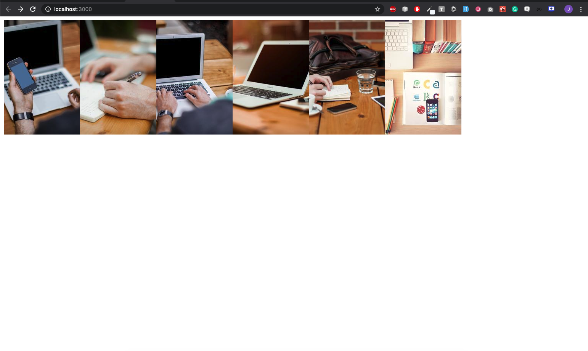

# Rendering Items in an Array

In Visual Studio code, press `command+shift+v` (Mac) or `ctrl+shift+v` (Windows) to open a Markdown preview.

## Getting Started

Using your command line, you will need to navigate to the this folder, install all dependencies, and start the app.

```bash
cd exercises/02-arrays/
code . # if you would like to open this in a separate VSCode window
yarn install
yarn start
```

If, at any time, you need to stop the app, press `ctrl+c`.

## Reason for the challenge

As a front end developer, rendering items to screen is an important skill to have.
In this challenge, you will be tasked with rendering a series of images to the screen.
Styling is not important in this challenge, but using the [.map function](https://developer.mozilla.org/en-US/docs/Web/JavaScript/Reference/Global_Objects/Array/map) is vital.

## Developer Instructions

1. Import the images from the image directory.
2. Iterate over each image and render them to the screen.

## Example



### LINK TO SLIDE

[Looping Through Arrays in JSX](https://slides.com/accjavascript/intro-to-react-044411#/12)
