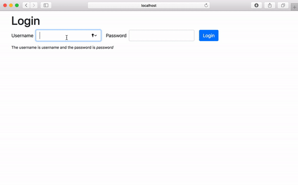

# Authentication Exercise with Routing and Context API

In Visual Studio code, press `command+shift+v` (Mac) or `ctrl+shift+v` (Windows) to open a Markdown preview.

## Reasons for the Challenge

Authentication is important because it enables organizations and businesses to keep their networks secure by permitting only authenticated users to access it's protected resources.

### Examples and Documentation

See [authentication with session cookies, routing and the Context API](../../examples/11c-authentication-routing/README.md).

## Getting Started

You will need to have two terminal windows open and running at once. If you are using Visual Studio Code, you can click on the split-screen or plus icon in your terminal panel:

 resources/authentication-server/two-terminals.png)

In one terminal window, you will need to run the authentication server. Please follow the steps [in this README.md](../../resources/authentication-server/README.md) on how to install and start the authentication server.

In the other terminal window, you will need to navigate to the this folder, install all dependencies, and start this exercise.

```bash
cd exercises/11b-authentication/
yarn install
yarn start
```

## User Stories

As a user, I would like to login so that I can see a list of my favorite movies.

As a user, I would like to get feedback when I enter the wrong username or password in the login form.

As a user, I expect to stay logged in when I refresh the page.

As a user, I need to be able to logout.



NOTE that instead of users, you will be rendering a list of movies.

## Acceptance Criteria

- You must use protected routes.
- After the user submits the login form, you must make an AJAX request to http://localhost:7000/cookie/login to login the user.
- If the user typed in an invalid username or password, you must display an error message telling them this.
- You should be getting the UUID from http://localhost:7000/cookie/login API and setting the UUID inside of a cookie and the Context API.
- Once the user has logged in, they should see a list of movies.
- When the user refreshes the page, they should still be logged in. This means they should still be able to see a list of movies from the http://localhost:7000/cookie/movies API.
- The user should be able to logout. After they logout, they should return to the login form.
- You will want to take advantage of the Context System to inform other components that a user is logged in.

## Developer Notes

Since we're using cookies as a way to authenticate the user, we will have to take an additional step to protect our content. With every GET request will send the server a UUID token that we received when we are first logged in. That UUID will be sent to the server and used to identify us. Please see the [server's README.md](../../resources/authentication-server/README.md) file for an example.

## Instructions

You will need to install React Router, JS Cookie and (optionally) axios. To do this:

```bash
yarn add react-router-dom js-cookie axios
```

You will be making AJAX calls to:

- http://localhost:7000/cookie/login
- http://localhost:7000/cookie/movies

[Please refer to the server documentation for more information on how to make these request.](../../resources/authentication-server/README.md)
