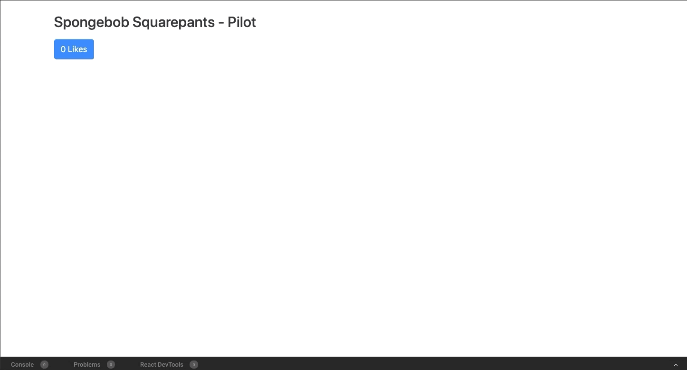
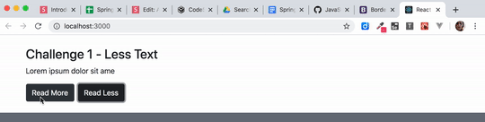
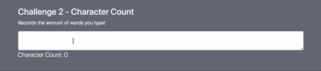

# State Challenge

In Visual Studio code, press `command+shift+v` (Mac) or `ctrl+shift+v` (Windows) to open a Markdown preview.

## Getting Started

Using your command line, you will need to navigate to the this folder, install all dependencies, and start the app.

```bash
cd exercises/12-class-state/
code . # if you would like to open this in a separate VSCode window
yarn install
yarn start
```

If, at any time, you need to stop the app, press `ctrl+c`.

## Reason for the Challenges

Managing state is often a source of heartache for many developers.
In these next few challenges will help you improve your ability to manage your app's state.

## Challenge 1

As a developer, I would like a component that onClick increments the press count.

### Instructions

1. Create a class component named "Likes" that accepts zero props.
2. OnClick will increment the click count and display the count on screen.

### Acceptance Criteria

The component will be a class based component that will use setState.



## Challenge 2

As a developer, I would like a component that has the ability to truncate text.

### Instructions:

1. Create a class component named "LessText" and it will accept two props.
2. Import and display your "LessText" class component inside of _exercises/12-class-state/src/App.jsx_.
3. The first prop will be named "text" and it will accept a string.
4. The second prop will be named "maxLength" and it will accept an integer.
5. Create "Read More" and "Read Less" buttons, which will toggle text based on the "maxLength".

### Acceptance Criteria

The class component will have two buttons. The first button will say "Read More". The second button will say "Read Less".

The "Read More" button will display the entire text. The "Read Less" button will truncate the set by the "maxLength" prop.



## Challenge 3

As a user, I would like to see the number of keystrokes a user types displayed on the screen.

### Instructions:

1. Create a class component named "CharacterCount". (It will not require any props.)
2. Import and display your "CharacterCount" component inside of _exercises/12-class-state/src/App.jsx_.
3. It will render a `<textarea>` textbox that will capture user input.
4. It will then render count of the number of characters in the textbox on the screen.


