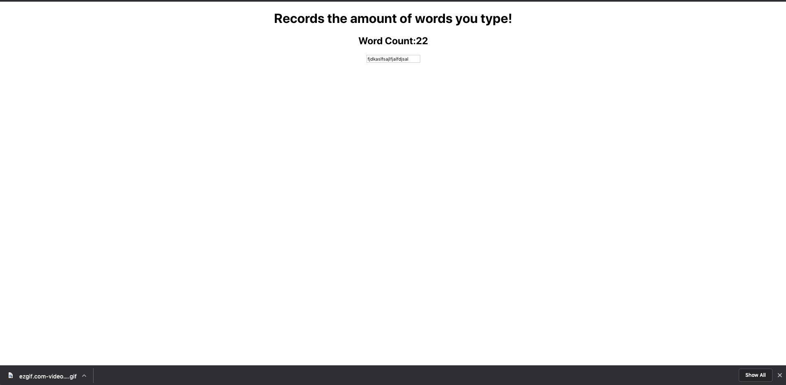
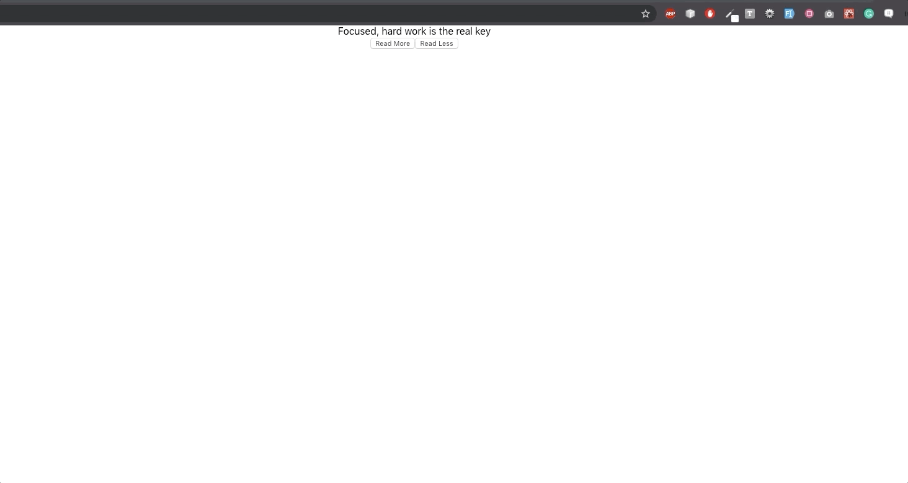

# State Challenge APP

### Reason for the challenge

Managing state is often a source of heartache for many developers.
In these next few challenges will help you improve your ability to manage your app's state.

### Developer Instructions

1. Import the images from the image directory.
2. Iterate over each image and render them to the screen.

### Challenge 1

As a user, I would like to see the number of keystrokes a user types displayed on the screen

# Instructions:

1. Create a component named "WordLength" that requires no props.
2. It will render an input field box that will capture user input
3. It will then render the length of the input on the screen.

# ScreenShot

### Challenge 2 

As a developer, I would like a component that has the ability to truncate text.

# Instructions:

1.  Create a component named LessText and it will accept two props.
2.  The first prop will be named "text" and it will accept a string.
3.  The second prop will be named "maxLength" and it will accept an integer.

# Acceptance Criteria

The component will have two buttons.
The first button will say "Read More"
The second button will say "Read Less"

The "Read More" button will display the entire text.
The "Read Less" button will truncate the set by the "maxLength" prop.

### Challenge 3)

- As a user, I would like to have an app that allows me to record my food purchases. The app should allow me to add grocery items to the list, update grocery items,
- and remove them from the list.
-
- Developer acceptance criteria:
- Create a component that accepts an array of objects.
- foodItems: [
  { food: 'Rice', cost: 100},
  { food: 'Beans', cost: 200}
  ]
- The component will iterate over the items and show them to the user. Developer discretion on how the app is styled(you will not be graded on styles)
